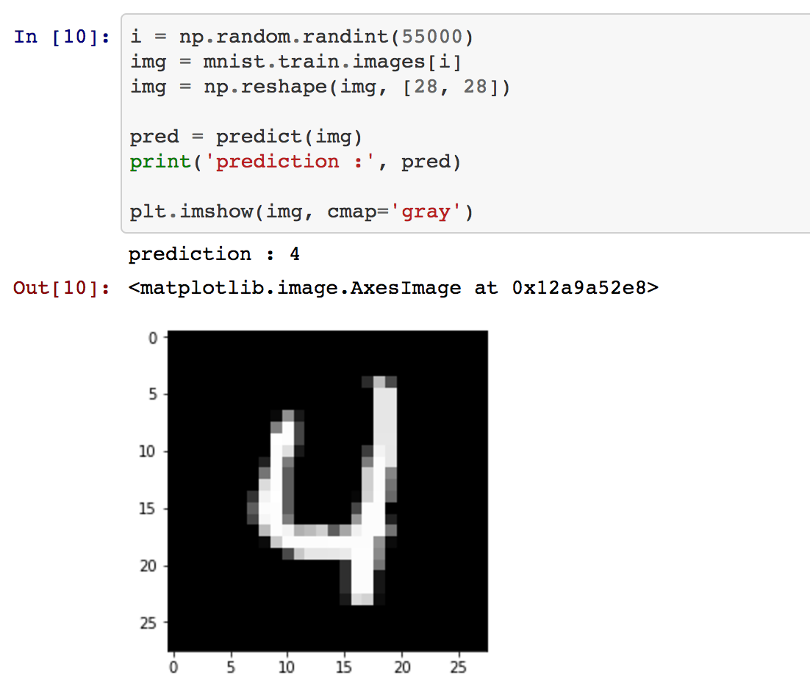

# numpy-RNN

numpy implementation of Recurrent Neural Networks

- [RNN_numpy](https://github.com/revsic/numpy-RNN/blob/master/RNN_numpy.ipynb) based on [iamtrask's github.io](https://iamtrask.github.io/2015/11/15/anyone-can-code-lstm/)
- [LSTM_numpy](https://github.com/revsic/numpy-RNN/blob/master/LSTM_numpy.ipynb) based on [wiseodd's github.io](http://wiseodd.github.io/techblog/2016/08/12/lstm-backprop/)

## Recurrent Neural Networks

Training Vanilla RNN for binary addition.

```python
largest = pow(2, BIN_DIM)
decimal = np.array([range(largest)]).astype(np.uint8).T
binary = np.unpackbits(decimal, axis=1)
```

Simply prepare the binary digit database. And propagate forward and backward to train binary addition.

```python
hidden = sigmoid(np.dot(X, w0) + np.dot(hidden_values[-1], wh))
output = sigmoid(np.dot(hidden, w1))

pred[pos] = np.round(output[0][0])
```

Training was successful with 100% accuracy.

```
----------
Iter 9000
Error : [ 0.68126419]
Pred : [1 0 1 0 1 0 0 0]
True : [1 0 1 0 1 0 0 0]
108 + 60 = 168
----------
```

## LSTM Networks

Training LSTM RNN for mnist handwritten digit recognition.

```python
mnist = input_data.read_data_sets('MNIST_data', one_hot=True)
```

Prepare the mnist digit database with `tensorflow.examples.tutorials.mnist.input_data`.

```python
caches, states = LSTM_Cell(Xt)
c, h = states[-1]

out = np.dot(h, wy) + by
pred = softmax(out)
entropy = cross_entropy(pred, Y)
```

Training the LSTM model with BPTT and it was successful to recognize handwritten digits.


